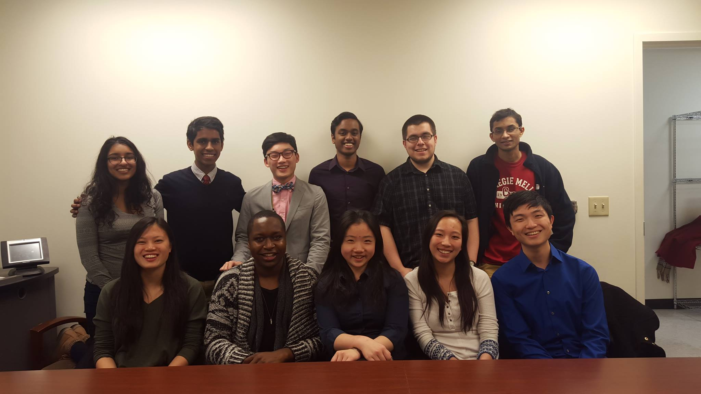

# Academic Affairs

## Chair: Eric Zhu

The Academic Affairs Committee of Student Senate is a committee that strives to create a conducive learning environment for Student Senate. Our initiatives usually concern policy changes and ways to change the culture of work ethic at Carnegie Mellon.

Initiatives:

* White Papers on Registration and Diversity
* Carnegie Mellon Wikipedia Page Updates
* Nightline
* Faculty Student Lunches

**Click on a file below!**